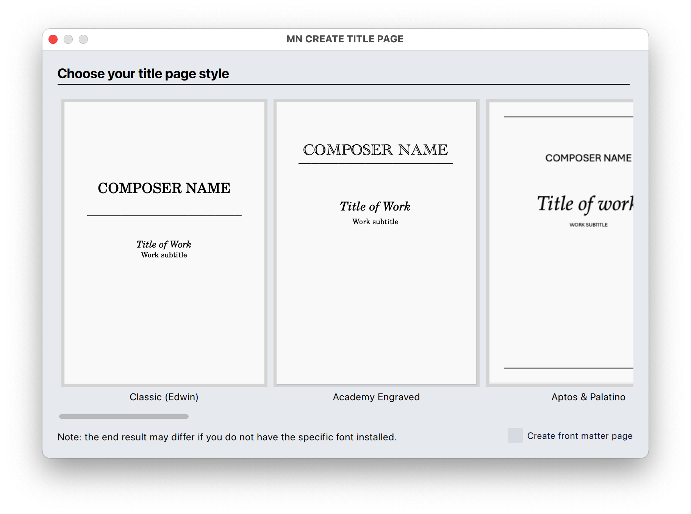

# MN Layout Plugins for MuseScore

A set of plug-ins for [MuseScore Studio 4.4](https://musescore.org/en) that provides some very useful functionality for your scores.

  

    <a href="#includedplugins">Included plug-ins</a> •
    <a href="#installation">Installation</a> •
    <a href="#fonts">Required Fonts</a> •
    <a href="#use">How to use</a> •
    <a href="#feedback">Feedback, requests and bug reports</a> •
    <a href="#license">License</a>
  

  

## Included plug-ins

###  MN CREATE TITLE PAGE
* **MN Create Title Page** automatically creates a professional-looking title page from the Title, Subtitle and Composer information entered on your score
* It lets you choose from a number of different templates/styles, many of which have been loosely modelled on professional music publishers’ house styles.
* **MN Create Title Page** will also, if required, automatically create a ‘front matter page’, with boilerplate text entered for you to populate (e.g. programme note, performance notes, instrumentation, etc.)
* **NOTE**: the bundled templates require commonly available fonts. Many of these fonts come with Mac OS X and/or Windows, or are installed by Microsoft Office. Some may need to be manually installed. See below for links to font downloads.

***

###  MN MAKE RECOMMENDED LAYOUT CHANGES

* **MN Make Recommended Layout Changes** automatically applies some key layout settings, as recommended by composer Michael Norris, such as:
  * **Spacing and layout**: staff size (based on the number of instruments), page margins, barline width, minimum bar width, spacing ratio, some style settings not optimal, bar number on first bar, staff spacing, system spacing, removes any manually added layout breaks, first system indentation
  * **Parts**: staff size (based on the number of instruments), page margins, barline width, minimum bar width, spacing ratio, some style settings not optimal, bar number on first bar, staff spacing, system spacing, first system indentation, multimeasure rests, multirest width
  * **Staff names and order**: Sets staff name visibility appropriate to ensemble size
  * **Fonts**: sets music font to Bravura, sets all tuplet, bar number, technique, expression font to Times New Roman, part name frame and padding, page number style to plain
  * **Other**: slur line width, title frame height and distance to music

***

## Installation

*MN Utility Plugins require MuseScore Studio 4.4 or later.*
* **Download** the project as a zip file either from the green Code button above, or from the direct download link below.
* **Extract it** using archive extraction software
* **Move the entire folder** into MuseScore’s plugins folder, configurable at [Preferences→General→Folders](https://musescore.org/en/handbook/4/preferences). The default directories are:
    * **Mac OS**: ~/Documents/MuseScore4/Plugins/
    * **Windows**: C:\Users\YourUserName\Documents\MuseScore4\Plugins\
    * **Linux**: ~/Documents/MuseScore4/Plugins
* **Open MuseScore** or quit and relaunch it if it was already open
* Click **Home→Plugins** or **Plugins→Manage plugins...**
* For each of the MN Utility plugins, click on their icon and click ‘**Enable**’
* The plugins should now be available from the **Plugins** menu
* You may also need to download and install fonts — see below

### Direct Download

Direct downloads of the Zip file can be found on the [releases page](https://github.com/mnorrisvuw/MN-Utility-Plugins-for-MuseScore/releases).

## Fonts

The title page templates make use of the following commonly available fonts. Many of these fonts come bundled with the Windows and/or Mac OS operating systems, with Microsoft Office, or as a free download.

Depending on your particular combination of OS and other software, **you may or may not already have them installed**. If you need to install them, below is a list of download links:
* **Academy Engraved LET**: bundled with Mac OS X; available for download [here](https://fontsgeek.com/fonts/Academy-Engraved-LET-Plain)
* **Alegreya Sans**: available for download [here](https://fonts.google.com/specimen/Alegreya+Sans)
* **Amulya**: available for download [here](https://www.fontshare.com/fonts/amulya)
* **Aptos**: bundled with Windows and Microsoft products; the latest available for download [here](https://www.microsoft.com/en-us/download/details.aspx?id=106087)
* **Archivo**: available for download [here](https://www.fontshare.com/fonts/archivo)
* **Avenir**: bundled with Mac OS X; available for download [here](https://www.dafontfree.io/avenir-font/)
* **Baskerville**: bundled with Mac OS X; Libre Baskerville, a very similar font, is available for download [here](https://fonts.google.com/specimen/Libre+Baskerville) — you will need to manually set the fonts to Libre Baskerville.
* **Bitter**: available for download [here](https://fonts.google.com/specimen/Bitter)
* **Bodoni Moda**: available for download [here](https://fonts.google.com/specimen/Bodoni+Moda)
* **Century Schoolbook**: bundled with Mac OS X; available for download [here](https://www.dafontfree.io/download/century-schoolbook/)
* **Chaparral Pro**: available for download [here](https://font.download/font/chaparral-pro)
* **Clash Display**: available for download [here](https://www.fontshare.com/fonts/clash-display)
* **Crimson Pro**: available for download [here](https://www.fontshare.com/fonts/crimson-pro)
* **EB Garamond**: available for download [here](https://fonts.google.com/specimen/EB+Garamond)
* **Fanwood Text**: available for download [here](https://www.theleagueofmoveabletype.com/fanwood)
* **Futura**: bundled with Mac OS X; available for download [here](https://www.dafontfree.io/futura-font-free/)
* **Gill Sans**: bundled with Max OS X and Windows 11; available for download [here](https://font.download/font/gill-sans-2)
* **Goudy Old Style**: bundled with Microsoft Office; available for download [here](https://font.download/font/goudy-old-style)
* **Helvetica Neue**: bundled with Mac OS X and Windows
* **Linden Hill**: available for download [here](https://www.theleagueofmoveabletype.com/linden-hill)
* **Literata**: available for download [here](https://www.fontshare.com/fonts/literata)
* **Lucida Bright**: available for download [here](https://fontsgeek.com/fonts/Lucida-Bright-Regular)
* **Lulo Clean**: available for download [here](https://www.fontshmonts.com/display-fonts/lulo-clean/)
* **Optima**: bundled with Mac OS X; available for download [here](https://www.dafontfree.io/optima-font/)
* **Palatino**: bundled with Mac OS X and Windows 11
* **Proxima Nova**: bundled with Mac OS X; available for download [here](https://www.dafontfree.io/proxima-nova-font-free/)
* **Rockwell**: bundled with Mac OS X; available for download [here](https://freefontsfamily.org/rockwell-font-free/)
* **Satoshi**: available for download [here](https://www.fontshare.com/fonts/satoshi)
* **Supreme**: available for download [here](https://www.fontshare.com/fonts/supreme)
* **U001Con**: available for download [here](https://fontlibrary.org/en/font/u001)
* **Work Sans**: available for download [here](https://open-foundry.com/fonts/work_sans_light)

## How to use
* **MN Create Title Page**: 
    * Before running this plug-in, make sure you have the default box (‘vertical frame’) at the top of your first page of music with the correct title, subtitle (e.g. ‘for string quartet’) and your/the composer’s name. The plug-in will use this information to create a new, styled title page.
    * Adding an image can be another nice touch. Once you’ve created your title page, right-click anywhere in the title page frame and choose Add→Image, then select an image from your hard-drive. Once added, you’ll need to resize the image (in Properties) and drag it into the correct location.

* **MN Make Recommended Layout Changes**:
    * You can run this plug-in at any time; however, it’s recommended that you have added all of the instruments you will need, and have at least two systems of music entered.

## Feedback, requests and bug reports

* Please send all feedback, feature requests and bug reports to michael.norris@vuw.ac.nz

* For bug reports, especially the ‘non-completion bugs’ mentioned above (i.e. the final dialog box does not show), **please send me your MuseScore file and the name of the plug-in.**

## License

This project is licensed under the terms of the GNU General Public License v3.0.  
See [LICENSE](LICENSE) for details.
